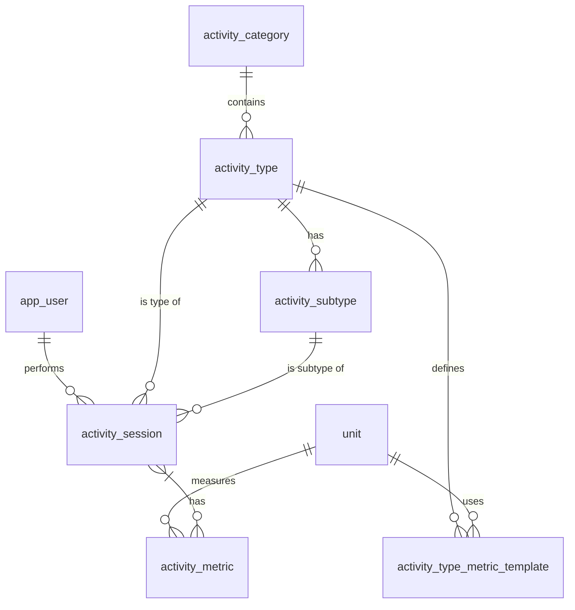

# **Workout & Activity Tracker – Database Requirements Document**  
*Version 1.0 | November 01, 2025*

---

## 1. Purpose

This document defines the **final database design** for a **universal activity tracking platform** that supports:
- Physical workouts (Weights, Running, Yoga, etc.)
- Cognitive activities (Chess, Language Learning)
- Creative pursuits (Painting, Music, Ballet)

The system must be **extensible**, **performant**, and **scalable** without schema changes for new activity types.

---

## 2. Scope

| In Scope | Out of Scope |
|--------|-------------|
| Core schema & relationships | User authentication logic |
| Metric flexibility (EAV) | Frontend UI |
| Auto-calculated fields | Real-time sync |
| Indexing strategy | Backup & recovery |
| Extensibility model | Mobile push notifications |

---

## 3. Functional Requirements

### FR-01: Activity Hierarchy
- Support **categories** → **types** → **subtypes**
- Examples:
  - `Physical` → `Weights` → `Bench Press`
  - `Creative` → `Painting` → `Watercolor`

### FR-02: Session Logging
- One session per activity instance
- Required: `started_at`, `activity_type`
- Optional: `ended_at`, `subtype`, `notes`, `location`

### FR-03: Duration Auto-Calculation
- `duration_minutes` **generated** from `ended_at - started_at`
- Must update if `ended_at` changes

### FR-04: Flexible Metrics
- Store **any metric** (sets, reps, weight, distance, pages, moves)
- Support **numeric** and **text** values
- Enforce **unit consistency**

### FR-05: Metric Templates
- Define default/required fields per `activity_type`
- Guide form input in UI

### FR-06: User Isolation
- All sessions tied to `app_user`
- Support multi-user (future: teams)

---

## 4. Non-Functional Requirements

| ID | Requirement |
|----|-----------|
| NFR-01 | **Performance**: < 50ms avg query for session list (1000 rows) |
| NFR-02 | **Scalability**: Support 1M+ sessions without schema changes |
| NFR-03 | **Extensibility**: Add new activity (e.g., "Knitting") via data only |
| NFR-04 | **Data Integrity**: Enforce FKs, unique names |
| NFR-05 | **Index Optimization**: Proper indexes for analytics (PRs, streaks) |

---

## 5. Data Model (Final Schema)

### 5.1 Tables

```markdown
### activity_category
| Column       | Type         | Constraints       | Description |
|--------------|--------------|-------------------|-----------|
| id           | SERIAL       | PK                | Auto-increment |
| name         | VARCHAR(50)  | NOT NULL, UNIQUE  | e.g., "Physical" |
| description  | TEXT         |                   | Optional |

### activity_type
| Column         | Type         | Constraints       | Description |
|----------------|--------------|-------------------|-----------|
| id             | SERIAL       | PK                | |
| name           | VARCHAR(100) | NOT NULL, UNIQUE  | e.g., "Running" |
| category_id    | INT          | FK → activity_category | |
| is_physical    | BOOLEAN      | DEFAULT TRUE      | |
| has_duration   | BOOLEAN      | DEFAULT TRUE      | |
| has_intensity  | BOOLEAN      | DEFAULT FALSE     | |
| description    | TEXT         |                   | |
| icon_url       | VARCHAR(255) |                   | |

### activity_subtype
| Column             | Type         | Constraints       | Description |
|--------------------|--------------|-------------------|-----------|
| id                 | SERIAL       | PK                | |
| activity_type_id   | INT          | FK → activity_type, ON DELETE CASCADE | |
| name               | VARCHAR(100) | NOT NULL          | e.g., "Bench Press" |
| description        | TEXT         |                   | |
| default_sets       | INT          |                   | |
| default_reps       | INT          |                   | |
| default_weight     | DECIMAL(6,2) |                   | |
| default_weight_unit| VARCHAR(10)  | DEFAULT 'kg'      | |
| **UNIQUE**         | (activity_type_id, name) | | |

### unit
| Column  | Type         | Constraints       | Description |
|---------|--------------|-------------------|-----------|
| id      | SERIAL       | PK                | |
| name    | VARCHAR(20)  | NOT NULL, UNIQUE  | e.g., "kilograms" |
| symbol  | VARCHAR(10)  |                   | "kg" |
| type    | VARCHAR(20)  |                   | "weight", "distance" |

### app_user
| Column     | Type         | Constraints       | Description |
|------------|--------------|-------------------|-----------|
| id         | SERIAL       | PK                | |
| username   | VARCHAR(50)  | UNIQUE            | |
| email      | VARCHAR(255) | UNIQUE            | |
| created_at | TIMESTAMP    | DEFAULT NOW()     | |

### activity_session
| Column           | Type         | Constraints       | Description |
|------------------|--------------|-------------------|-----------|
| id               | SERIAL       | PK                | |
| user_id          | INT          | FK → app_user     | |
| activity_type_id | INT          | FK → activity_type, NOT NULL | |
| activity_subtype_id | INT       | FK → activity_subtype | Optional |
| started_at       | TIMESTAMP    | NOT NULL          | |
| ended_at         | TIMESTAMP    |                   | |
| **duration_minutes** | INT      | **GENERATED**     | `(ended_at - started_at)/60` |
| location         | VARCHAR(100) |                   | |
| mood_before      | VARCHAR(50)  |                   | |
| mood_after       | VARCHAR(50)  |                   | |
| notes            | TEXT         |                   | |
| created_at       | TIMESTAMP    | DEFAULT NOW()     | |
| updated_at       | TIMESTAMP    | DEFAULT NOW()     | |

### activity_metric (EAV)
| Column              | Type         | Constraints       | Description |
|---------------------|--------------|-------------------|-----------|
| id                  | SERIAL       | PK                | |
| session_id          | INT          | FK → activity_session, ON DELETE CASCADE | |
| metric_name         | VARCHAR(50)  | NOT NULL          | "sets", "distance_km" |
| metric_value_numeric| DECIMAL(10,3)|                   | |
| metric_value_text   | TEXT         |                   | |
| unit_id             | INT          | FK → unit         | |
| **CHECK**           | One value not null | | |

### activity_type_metric_template
| Column         | Type         | Constraints       | Description |
|----------------|--------------|-------------------|-----------|
| id             | SERIAL       | PK                | |
| activity_type_id | INT        | FK → activity_type, ON DELETE CASCADE | |
| metric_name    | VARCHAR(50)  | NOT NULL          | |
| unit_id        | INT          | FK → unit         | |
| is_required    | BOOLEAN      | DEFAULT FALSE     | |
| display_order  | INT          | DEFAULT 0         | |
| **UNIQUE**     | (activity_type_id, metric_name) | | |
```

---

## 6. Relationships (ER Summary)



---

## 7. Indexes (Performance)

```sql
-- Session listing & analytics
CREATE INDEX idx_session_user_type_date 
    ON activity_session(user_id, activity_type_id, started_at DESC);

-- Metric lookups (PRs, progress)
CREATE INDEX idx_metric_name_value 
    ON activity_metric(metric_name, metric_value_numeric DESC);

-- Date-based queries (streaks)
CREATE INDEX idx_session_date 
    ON activity_session(DATE(started_at));
```

---

## 8. Constraints & Validation

| Rule | Enforcement |
|------|-----------|
| Unique activity names | `UNIQUE(name)` |
| Valid unit per metric | FK + template |
| One value per metric | `CHECK` constraint |
| Duration auto-calc | `GENERATED ALWAYS` |

---

## 9. Extensibility Model

### To Add New Activity (e.g., "Chess")
```sql
INSERT INTO activity_category (name) VALUES ('Cognitive');
INSERT INTO activity_type (name, category_id, has_duration) 
VALUES ('Chess', (SELECT id FROM activity_category WHERE name='Cognitive'), TRUE);

INSERT INTO activity_type_metric_template 
    (activity_type_id, metric_name, unit_id, is_required) VALUES
    ((SELECT id FROM activity_type WHERE name='Chess'), 'duration_minutes', 
     (SELECT id FROM unit WHERE name='minutes'), TRUE),
    ((SELECT id FROM activity_type WHERE name='Chess'), 'moves', 
     (SELECT id FROM unit WHERE name='count'), FALSE);
```

> **No schema changes required**

---

## 10. Sample Data

```sql
-- Units
INSERT INTO unit (name, symbol, type) VALUES 
('kilograms', 'kg', 'weight'), ('minutes', 'min', 'time'), ('count', '', 'count');

-- Activity: Bench Press
INSERT INTO activity_type (name, category_id) 
VALUES ('Weights', (SELECT id FROM activity_category WHERE name='Physical'));

INSERT INTO activity_subtype (activity_type_id, name, default_sets, default_reps) 
VALUES ((SELECT id FROM activity_type WHERE name='Weights'), 'Bench Press', 4, 8);
```

---

## 11. Analytics Support

| Query | Supported? |
|------|-----------|
| Personal Record (PR) | Yes via `MAX(metric_value_numeric)` |
| Progress Over Time | Yes via `DATE_TRUNC` |
| Streaks | Yes via window functions |
| Weekly Volume | Yes via `SUM(sets * reps * weight)` |

---

## 12. Risks & Mitigations

| Risk | Mitigation |
|------|----------|
| EAV performance | Proper indexing + materialized views |
| Metric name typos | Use templates + UI enforcement |
| Unit mismatch | FK + default units |

---

## 13. Approval

| Role | Name | Date | Signature |
|------|------|------|----------|
| Database Architect | _ | _ | _ |
| Backend Lead | _ | _ | _ |
| Product Owner | _ | _ | _ |

---

**End of Document**

---

**Download**: [`database-requirements.md`](#) (Copy-paste ready)

Let me know if you want:
- PDF version
- Confluence template
- SQL DDL export
- ER diagram PNG

This is **production-ready**.